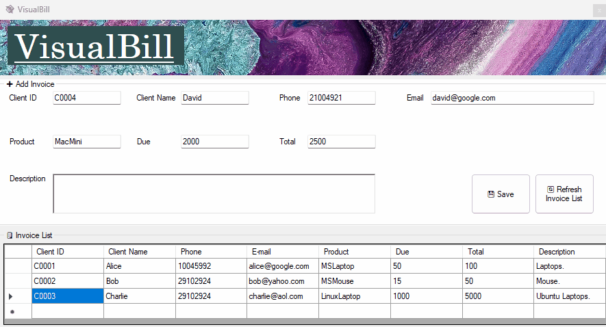
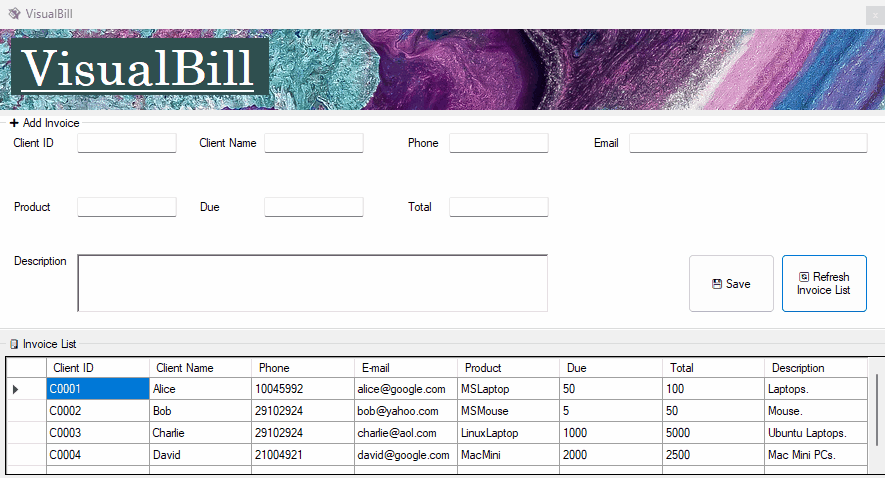

# VisualBill

An invoice management system built on VB.NET, and Microsoft SQL Server Express.

## Features

### Invoice CRUD

#### Create Invoice

You can create new invoice into the system.

#### Read Invoice

You can view the invoices in the system via the invoice list.

Direct modification of dataset (i.e. through SSMS) is supported as well, simply click "Refresh Invoice List" once you are done modifying.

#### Update Invoice

You can update the invoices in the system (except for the invoice ID) by click on the details within the invoice list and making your own adjustments, then press `Enter`.

#### Delete Invoice

You can delete the invoice in the system by selecting the respective rows and pressing the `Delete` key on your keyboard.

### Error-checking

#### Duplicate Invoice ID

Duplicate invoice ID are prevented from being entered into the system.

#### Editing of Invoice ID

Direct editing of invoice ID is not permitted. The only way to do so is to delete and recreate.

## Build instructions

1. Install Microsoft Visual Studio 2022 or higher
2. Install Microsoft SQL Server 16.0.1000 or higher
3. Install MS SQL Server Management Studio v20.2 or higher
4. Attach the database MDF file to your SQLEXPRESS instance
5. Modify the connection string under `App.config` to point to the right DB location if needed
6. Build the program and run

## Credits

- [Invoice Billing System Software Using VB.Net]() for inspiration.
- [Background Image by Stefan Schweihofer from Pixabay](https://pixabay.com/photos/color-acrylic-paint-art-painting-4158152/)